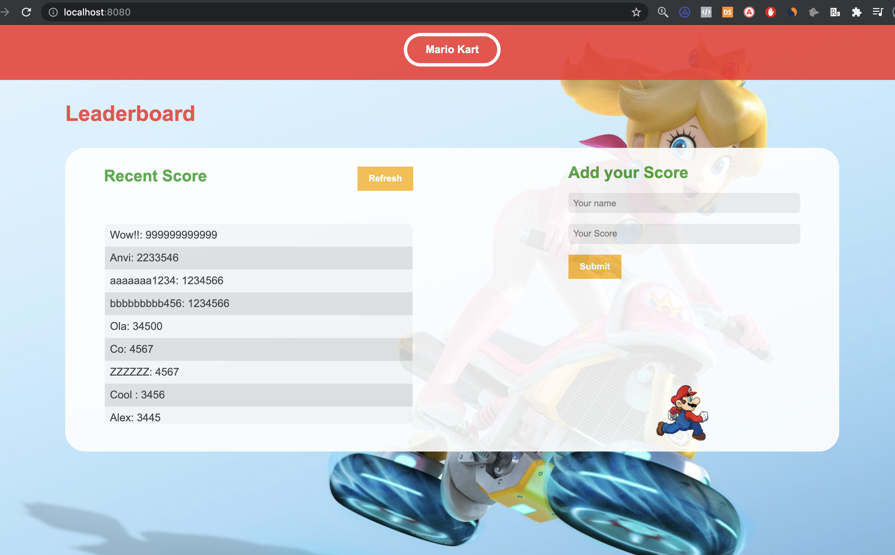
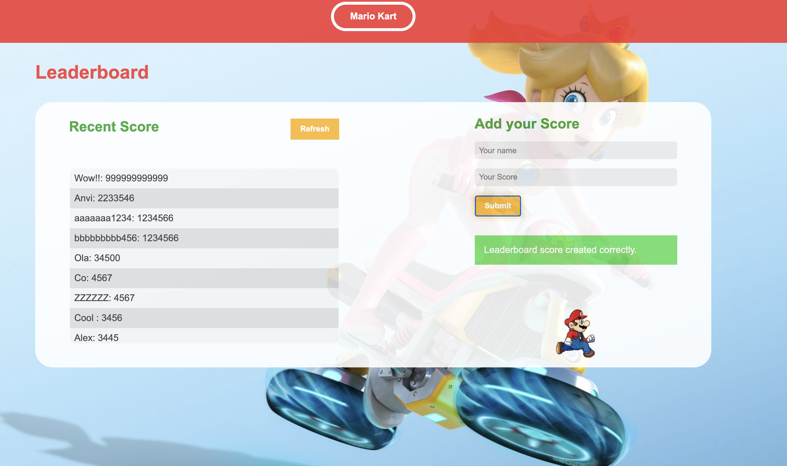
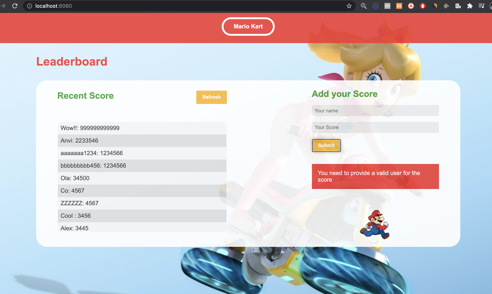

# Leaderboard: hit the API

## Learning objectives

- Send and receive data from an API.
- Use API documentation.
- Understand and use JSON.
- Make JavaScript code asynchronous.


## Description

The leaderboard website displays scores submitted by different players. It also allows you to submit your score. All data is preserved thanks to the external [Leaderboard API service](https://www.notion.so/microverse/Leaderboard-API-service-24c0c3c116974ac49488d4eb0267ade3).

I have also implemented the actions behind the "Refresh" and "Submit" buttons to make calls to the Leadboard API.





### LIVE DEMO

https://anvi98.github.io/Leadboard/


### General Good Practice

- Make sure that there are [no linter errors](https://github.com/microverseinc/linters-config).
- Make sure that I used correct flow [Gitflow](https://github.com/microverseinc/curriculum-transversal-skills/blob/main/git-github/articles/github_flow.md).
- Make sure that I documented your work [in a professional way](https://github.com/microverseinc/curriculum-transversal-skills/blob/main/documentation/articles/professional_repo_rules.md).


### Project requirements

- Read the [Leaderboard API documentation](https://www.notion.so/microverse/Leaderboard-API-service-24c0c3c116974ac49488d4eb0267ade3) to learn how to use this API.
- Create a new game with the name of your choice by using the API.
- Implement the "Refresh" button (receiving data from the API and parsing the JSON).
- Implement the form "Submit" button (sending data to the API).
- Use `async` and `await` JavaScript features to consume the API.
- No styling at this stage or branch.

<p align="center">
  
</p>

- I'm Using ES6 modules, with *import* and *export*.

### Setup the Project
you can clone this repos by typing in your console:
````
git clone git@github.com:Anvi98/Leadboard.git
````
You should make sure to be on the **feature-api** branch before going further.
Next, run:
````
npm install
````
```
npm run build
```
Then
```
npm run serve
```

## **Authors**

👤 **Alex Eponon**
​
- GitHub: [@Anvi98](https://github.com/Anvi98)

- Twitter: [@anvi_al](https://twitter.com/anvi_al)

- LinkedIn: [Alex Eponon](https://www.linkedin.com/in/anvi-alex-eponon/)

